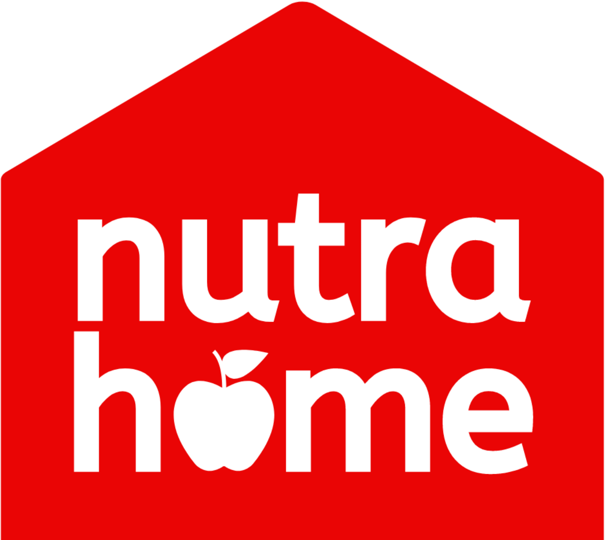

# Nutrahome API

- Run server globally:
    
    ```
    $ pm2 start index.js
    $ lt --port 6789
    ```

- Restart server

    ```
    $ pm2 restart index.js
    ```

- Log server

    ```
    $ pm2 log
    ```